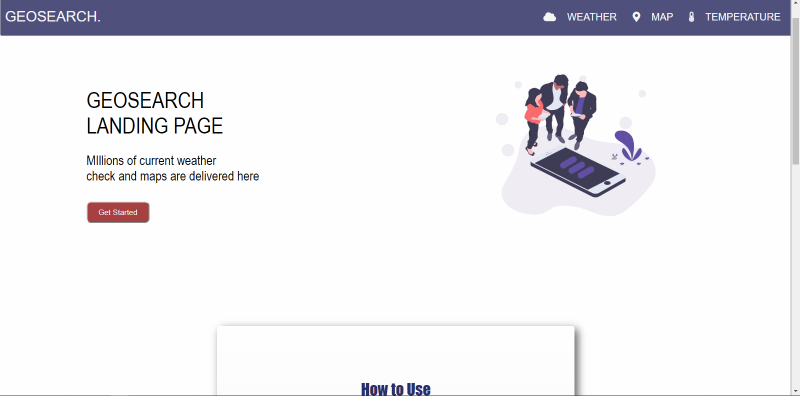

# Geosearch

### Description:
Geosearch is a web app that  allow users to get information such as local weather condition and temperature of places searched. Users also have the option to make  interconversion of temperature between Celsius and Fahrenheit.

### Technology stack:
* HTML5
* CSS3
* Javascript(Vanillajs)

### Status:
A completed capstone project at [DevCtraining with Andela](https://devctraining.andela.com)

### Image: 
    

### live preview:  
https://personalgeosearch.netlify.app

### Setup:
1. Copy the repository link 
2. On your commandline/terminal, change the current working directory to the location where you want the cloned directory.
3. Type ``` git clone https://github.com/tech-doctor/Geosearch.git ```.(make sure the link is the link to the repository)
4. press enter to create your local clone.

### Reqirement & Resources for development: 
 * Any IDE (VSCode, Bracket, Atom, Sublime e.t.c)
 * Basic knowledge in HTML, CSS and Javascript
 * Knowledge in fetching and displaying data from a remote API 
 #### API USED: 
 [Openweathermap API](https://openweathermap.org/api)

    
